# How to Deploy EMA RTO Application to Azure

- Last Update: June 2024
- Compiler: Java, Docker, and Maven
- Prerequisite: RTO Authentication Version 2 credential

Example Code Disclaimer:
ALL EXAMPLE CODE IS PROVIDED ON AN “AS IS” AND “AS AVAILABLE” BASIS FOR ILLUSTRATIVE PURPOSES ONLY. REFINITIV MAKES NO REPRESENTATIONS OR WARRANTIES OF ANY KIND, EXPRESS OR IMPLIED, AS TO THE OPERATION OF THE EXAMPLE CODE, OR THE INFORMATION, CONTENT, OR MATERIALS USED IN CONNECTION WITH THE EXAMPLE CODE. YOU EXPRESSLY AGREE THAT YOUR USE OF THE EXAMPLE CODE IS AT YOUR SOLE RISK.

## How to deploy to Azure Cloud Service

Normally, there are various ways to deployed an application on the cloud service like create a Virtual Machine (VM) on the cloud, or use the Serverless or Platform as a Service (PaaS) to run application's source code on the cloud, or use the fully managed container orchestration service to run an application's container. It is based on your preference of manageability, business logic and cost to choose which way is suitable for you.

The VM way is supported by all major Cloud services like the [Azure Virtual Machine](https://azure.microsoft.com/en-us/products/virtual-machines), [AWS EC2](https://aws.amazon.com/ec2/), and [Google Cloud Compute Engine](https://cloud.google.com/products/compute/). However, it requires a lot of manual work such as manage and set up the machine, install all application's dependencies, and run an application by yourself manually. This is the reason our article does not choose the VM way.

Since our MDWebService application already have been containerize, this article chooses the fully managed container orchestration service way.

Azure provides various services for supporting different requirements,cost, and your application's preference. You can find more detail about the comparisons of all services that supports containerized applications on Azure on [Comparing Container Apps with other Azure container options](https://learn.microsoft.com/en-us/azure/container-apps/compare-options) and [Difference between Azure Container Instances and Azure Container Apps - serverfault](https://serverfault.com/questions/1083358/difference-between-azure-container-instances-and-azure-container-apps) websites. I am choosing the [Azure Container Instances service](https://azure.microsoft.com/en-us/products/container-instances) which is the easiest one.

### Container Registry

Azure also has the [Container Registry Service](https://azure.microsoft.com/en-us/products/container-registry) repository for storing and managing container images and artifacts with a fully managed environment within Azure. This repository requires the [Azure CLI](https://learn.microsoft.com/en-us/cli/azure/) tool to push/pull an application image to Azure container registry.

However, the service also supports [Docker Hub registry](https://hub.docker.com/) repository, so I am choosing this way because I can set other Cloud Container solutions to pull image from Docker Hub as well.

### Push Image to Docker Hub

The steps to push an MDWebService application image to Docker Hub repository are as follows.

Firstly, log in to [Docker Hub registry](https://hub.docker.com/) website, and select the **Create repository** button.

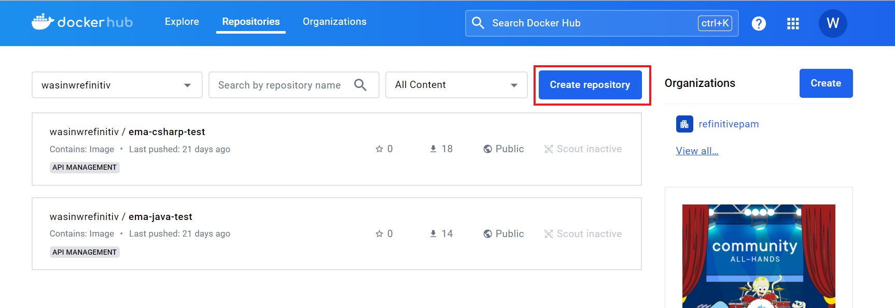

Next, input **Repository Name** as *mdwebservice-rto*, input a short description of your image, and choose **Public Visibility**. And then click the **Create** button.

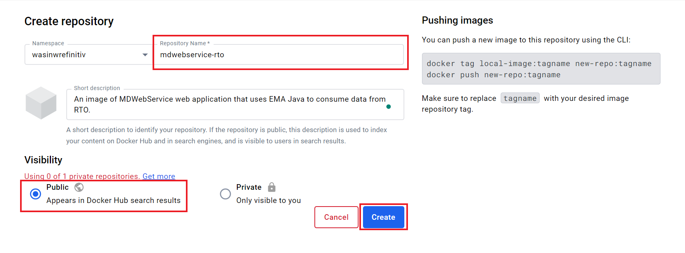

Once the repository is created successfully, the page redirects you to your repository page which contains commands to [push](https://docs.docker.com/reference/cli/docker/image/push/) your local image to this repository.

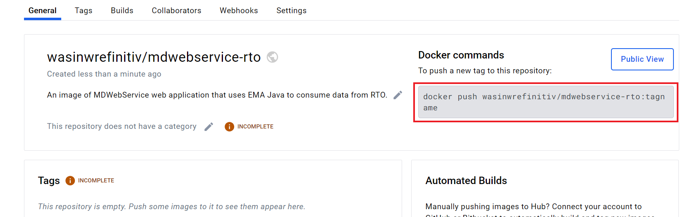

Moving on to the next step to push image, open a command prompt and run the following command to log in to Docker Hub via the CLI.

```bash
docker login -u YOUR-USER-NAME
```

Then input your Docker Hub account credential (*password* or *token*), then press the Enter button

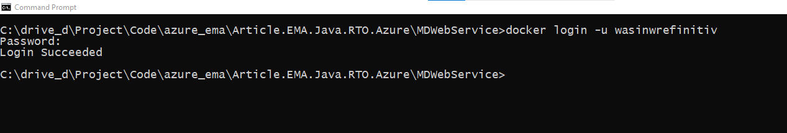

Once you have logged in to Docker Hub on the CLI, use the [docker tag]((https://docs.docker.com/reference/cli/docker/image/tag/)) command to give the *mdwebservice-rto* image a new name.

```bash
docker tag mdwebservice-rto wasinwrefinitiv/mdwebservice-rto
```

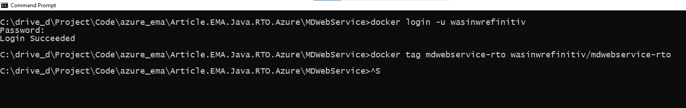

Once the image has been tagged, run the docker push command. Please note that if you don't specify a tagname part, Docker uses a tag called latest.

```bash
docker push wasinwrefinitiv/mdwebservice-rto
```

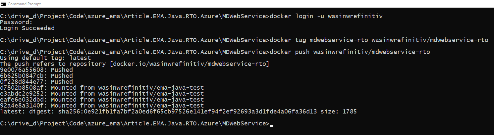

Then go back to Docker Hub website, the repository page shows your image detail. You can add the repository's category and overview based on your preference.

Please note that your image name is **&lt;your namespace&gt;/&lt;repository name&gt;** (*wasinwrefinitiv/mdwebservice-rto* in my case).


You can find more detail about how to push an application image to Docker Hub on [Share the application](https://docs.docker.com/get-started/04_sharing_app/) document.

### Creating Azure Container Instances

Firstly, open a web browser to [Azure portal](https://azure.microsoft.com) website, then type *Container Instances* in a search bar. The Container Instance Service menu will be appeared, choose that menu.

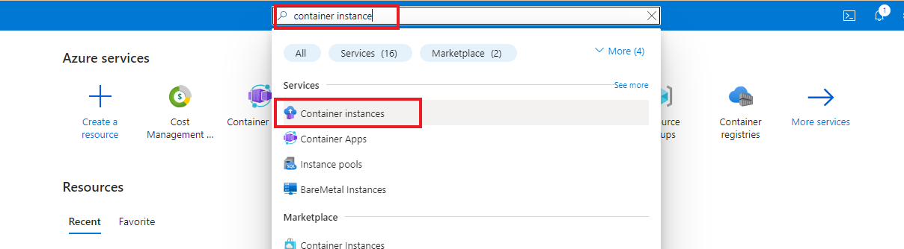

The page redirects to the Container Instances resource management page. To create a container, you can click either the *+Create* button or *Create container instances* button.

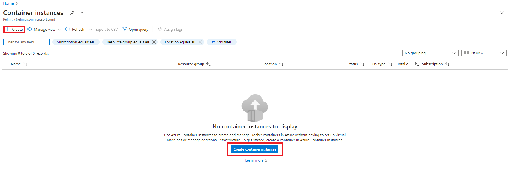

You are now in the Container instances creation page. The first step is choosing your Azure subscription and create a new Resource group. I choose the *mdwebserivce-rto* name for the new Resource Group.

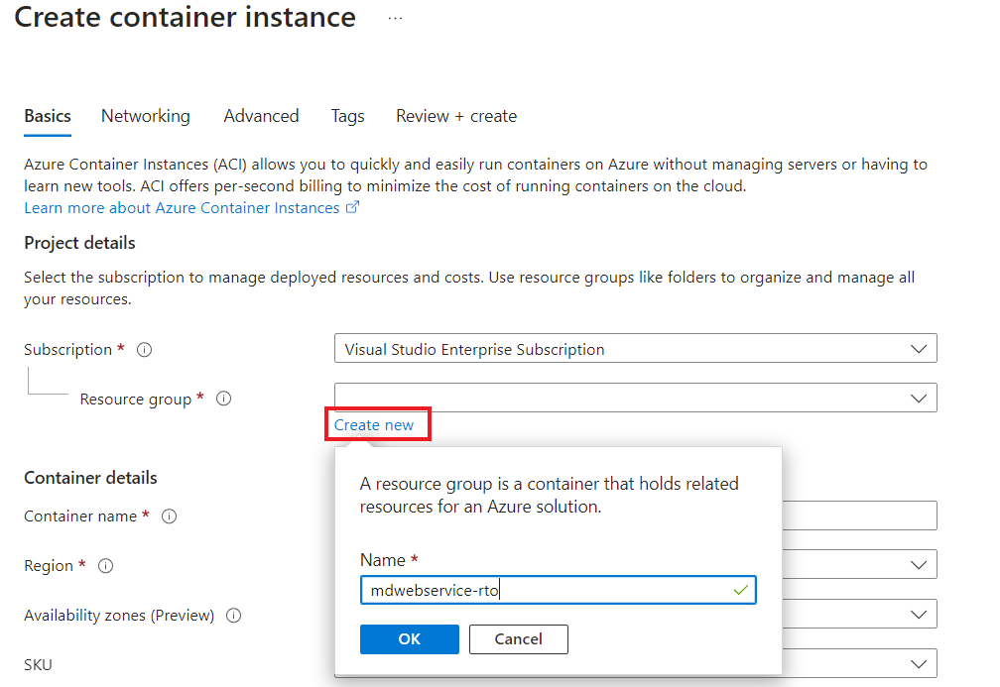

Next, input a container name. I choose *mdwebservice-rto* as my container name. Select your prefer region and numbers of [Availability zone](https://learn.microsoft.com/en-us/azure/reliability/reliability-containers).

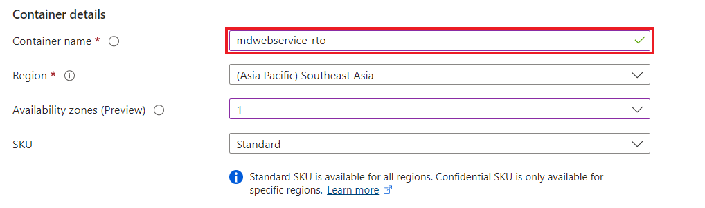

Now we need to input the image detail as follows, and then click the *Next: Networking* button.

- Image source: For [Docker Hub registry](https://hub.docker.com/), choose *Other registry*
- Image type: Public
- Image: Input your image name (**&lt;your namespace&gt;/&lt;repository name&gt;**)
- Leave other options as is.

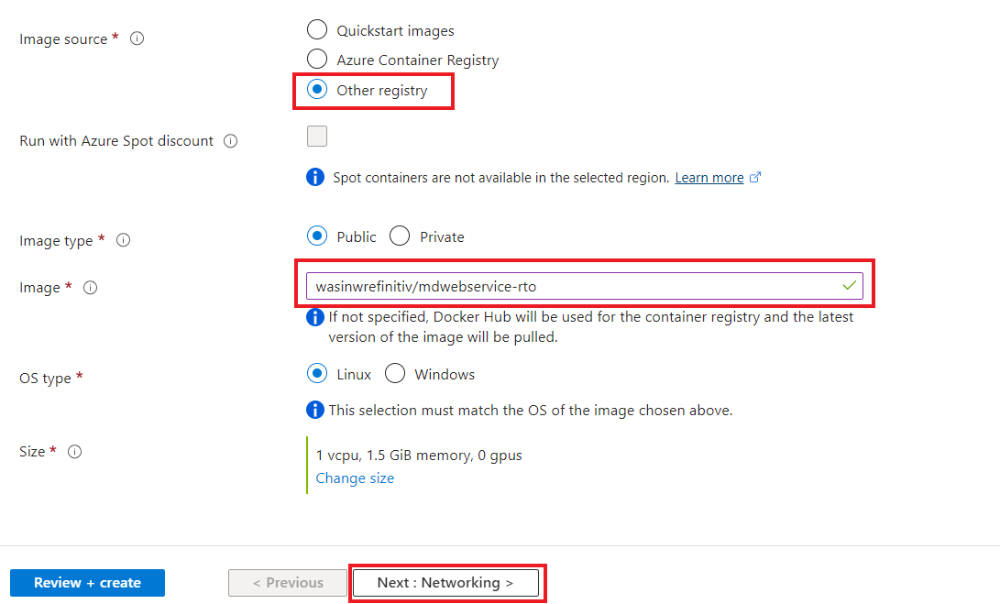

That brings us to the network creation page. Set the DNS named label to *mdwebservice-rto* and add the following ports with type **TCP** to our instance:

- 8080 (for our Web Server)
- 443 (for connecting to RDP API)
- 14002 (for the RSSL connection)

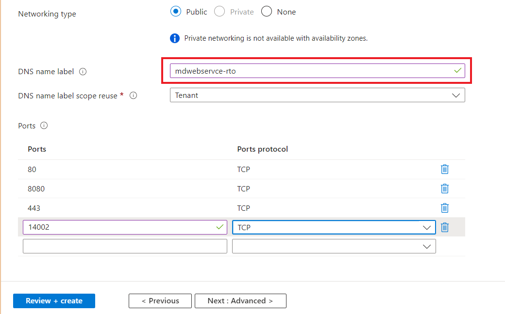

And click the *Next: Advanced* button.

Moving on to advanced page. We can set a container's Environment Variables here. Please choose *Mark as secure* as *Yes* and input the following keys and values

- CLIENT_ID: Your Authentication V2 Client ID
- ClIENT_SECRET: Your Authentication V2 Client Secret

And click the *Next: Tags* button.

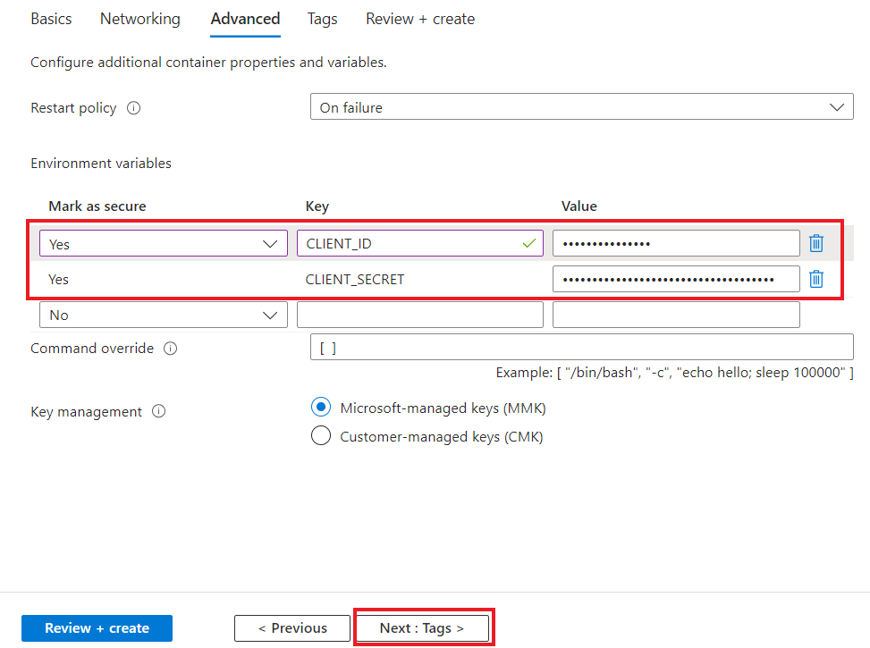

Next, choose your prefer tag names and values, then click the *Next: Review + create* button.

Now we come to the final step. You can review your setting here and go back for changing any properties you need. If set up looks fine, click the *Create* button.

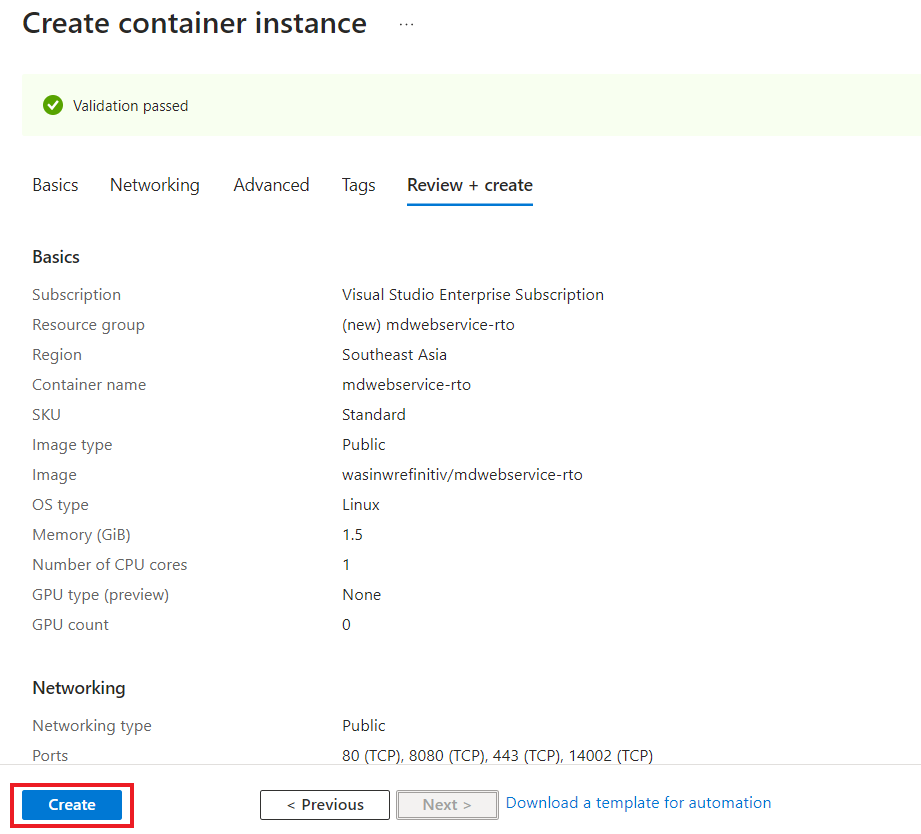

Then the Azure Container Instances service deploys your image.

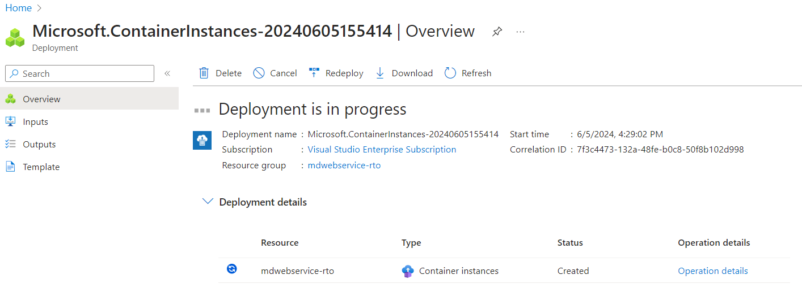

Once deployment is completed. You can click the *Go to resource* button to check your newly deployed container.

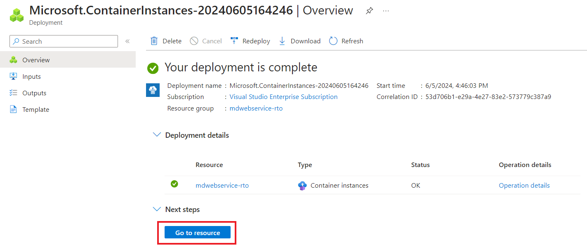

That brings us to the mdwebservice-rto instance resource page. The overview page contains the statistic of resource usages, container status, and the Public IP Address and container's automatically assigned DNS name. Please note that you can start, stop, and delete the instance from this resource page too.

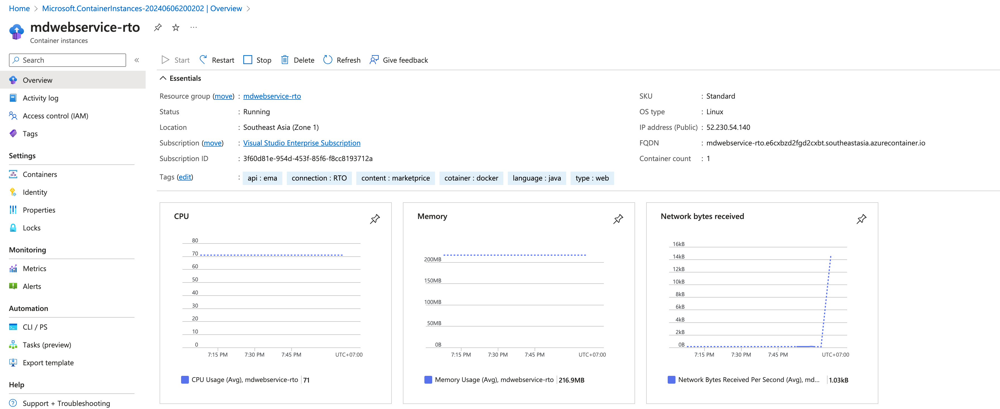

You can click on the Settings --> container tab --> Log to check the application's console log messages.

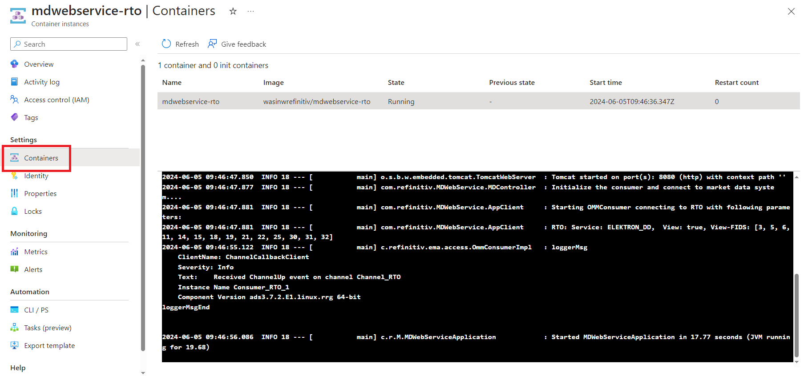

To test the deployed web server instant, copy the DNS url from the *FQDN* property (in the red circle), and open it on your web browser as *http://&lt;FQDN name&gt;:port/quotes/RIC_Code* URL.


Please note that with the autogenerated domain name, *the URL might be blocked by corporate firewall or network policy*. I am testing and capturing the image from my personal machine.


That’s all I have to say about how to deploy a web service container to Azure.

## Clean Up

My next point is how to clean up the resources if you do not need to run an instance anymore (for **cost saving** too!).

On the Container Instance Resources page, you can restart, stop, or delete an instance from the menu on this page.

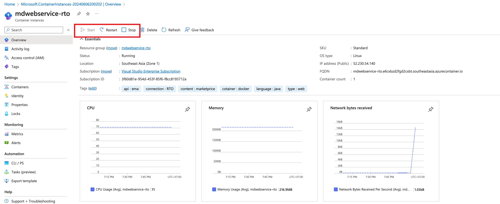

That covers overall steps of deploying EMA instance on the Azure Container Instance service.