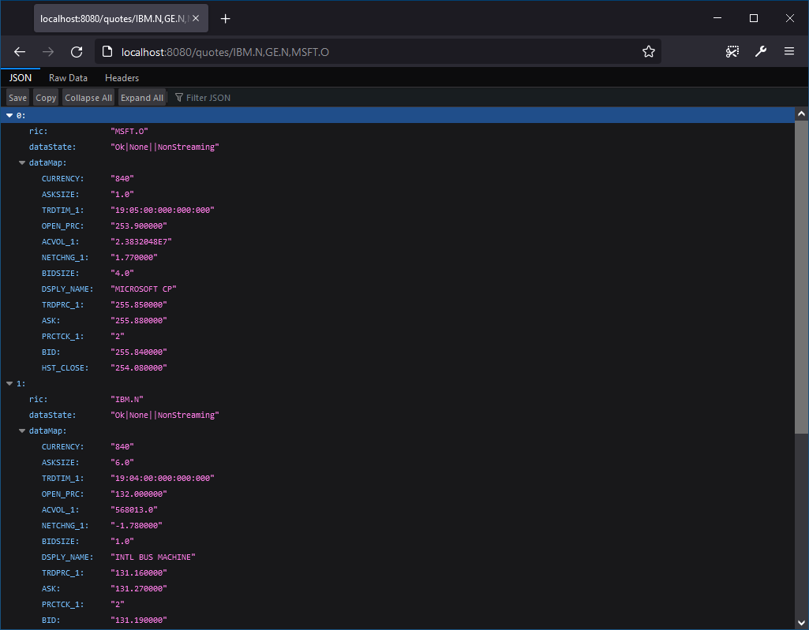

# How to build a scalable web service for stock prices
Web services or Remote Procedure Call (RPC) are often used to provide data to internal pricing systems, which need to have a standardized means to get data, but not deal with the complications of working with market data systems. This requirement usually stems from the need to have a uniform access to multiple services - which might be internal databases, messaging services and reporting systems - all of which might typically provide data through a web service. In such a scenario, it is desirable that the stock prices (a.k.a market data), be also available through a web service. Providing pricing data as a web service, moves the programming complication away from the consumer application into the service itself. Web services also make it easier to integrate the market data application with standardized tools 3rd party like *PowerApps, BusinessWorks, Tableau, Postman etc*.


## Is it REST service
REST is a philosophy and not a standard, and because of this ambiguity most of the web services which are actually RPC calls, get called a REST service. In this article, we look at building a scalable RCP service, and also look to how it can be deployed to cloud, to take advantage of scalability solutions provided by cloud providers. These are a developer's notes in trying to build a such a service and can be used to understand the process. It is not a comprehensive guide to cloud scalable solution and skips a lot of important details like authentication, security, redundancy, and hybrid deployment option. This article also looks into one of the many ways, this web-service could be developed and deployed.

## What is needed
Many clients are looking to leverage cloud to reduce the operating infrastructure costs. While, it can be achieved in a "lift and shift" operation, i.e. by simply utilizing the cloud provider's compute resources, instead of an on-prem physical hardware; often there is a need to update the application as well. A pricing web service should provide following capabilities: 

* Authenticate user application
* Provide hot/warm standby
* On-demand horizontal scalable
* Load balanced
* Secure from external access
* Provide service control panel 
* Telemetry data
* Comprehensive logging
* Be load tested
* Provide encrypted access, i.e. https

In this sample I will just touch on the web service application code, and technique used to package and deploy it to Amazon AWS cloud. It can be deployed to other cloud providers or to on-prem servers as well. A user will need to implement all the missing requirements in their application code themselves.

## Application code
Many frameworks can be used for building a web service. I have considered using Apache Spring framework - specifically *Spring:Boot* as it abstracts the configuration from the actual service code. The *spring:boot* provides all the necessary plumbing for creating concurrent access web-service endpoints, and the user code only has to deal with the business logic. The market data specifics are handled by the Refinitiv Real Time SDK (EMA Java). 

The complete application can be packaged up in a Docker container and deployed to a horizontally scalable infrastructure, where it can source pricing data from Refinitiv cloud.


The Spring creates a server, defines the service endpoints and manages the multi-threaded incoming requests. It also initializes the realtime SDK which establishes the network connection with backend pricing data provider. The application is written to makes a synchronous-snapshot request for pricing data, for the list of instruments in the web request. Let us examine the code snippets which perform these actions. Complete code is available in the linked GitHub repo. Here is the high level flowchart of application code:


#### Initialize the web service and market data connection
In this code in the MarketData controller, we attach the *@EventListener* annotation which tells spring to invoke this method, when the web subsystem is ready. We in turn invoke the *initialize()* method on the OMM consumer. 

```
@EventListener
public void onApplicationEvent(ContextRefreshedEvent event) {
	LOG.info("Initialize the consumer and connect to market data system....");
	ommCons.initialize();
}	
```

The *Consumer* class creates the *EMA OMMConsumer*, using the configuration parameters defined in the application properties file. EMA SDK will try to connect to market data system, upon creation of *OMMConsumer* object automatically.
```
consumer  = EmaFactory.createOmmConsumer(EmaFactory.createOmmConsumerConfig()
	.host(hostName + ":" + port)
	.username(userName));
```

The configuration parameters which are defined in the *application.properties* file and can also be over-ridden from the command line, are auto-injected into our application, since consumer is annotated with *@Service* tag:
```
@Value("${MarketData.ServiceName}") 
private String serviceName;
```

#### Web request
I decided to use the [http://service_host:port/**quotes/item1,item2,...**]() format as the web service endpoint. This was achieved by annotating *@GetMapping("/quotes/{items}")* on the *getQuote* method on the *MDController*. 

```
@GetMapping("/quotes/{items}")
@ResponseBody
public InstrumentData[] getQuote(@PathVariable String[] items) throws Exception {
	LOG.info("Quote request for: {}", java.util.Arrays.toString(items));
	// create a batch request
	Batch btc = new Batch(items, timeout);
	// price it
	ommCons.synchronousRequest(btc);
	// send json array response
	return btc.getAllInstruments();
}
```

The list of requested instrument symbols are available in the *items[]* array thanks to *@PathVariable*. A batch object is created which in-turn creates an array of instrument object for each of the requested items. The purpose of the *batch* object is to track when all the instruments receive a response or when the request times-out. 

#### Synchronous market data request
*Consumer* class implements a synchronous call to get pricing data. The real time programming in general and and RTSDK specifically, is implemented asynchronously, using the event driven programming paradigm. For an application to initiate a market data request and wait for it to be fulfilled, some programming tricks are required. In this application, it is achieved using Java synchronous helper - namely *java.util.concurrent.CountDownLatch*. The *CountDownLatch* provides an *await()* method which blocks the call, until the latch is counted-down predetermined times using *countDown()* or it times out.

Here is what the complete *synchronousRequest()* method of consumer looks like:

```
public void synchronousRequest(Batch bRequest) throws Exception	{
	ElementList eList = EmaFactory.createElementList();
	OmmArray array = EmaFactory.createOmmArray();
	for(String instr : bRequest.getAllRics())
		array.add(EmaFactory.createOmmArrayEntry().ascii(instr));
	eList.add(EmaFactory.createElementEntry().array(EmaRdm.ENAME_BATCH_ITEM_LIST, array));
	
	if(applyView)	{
		OmmArray vArray = EmaFactory.createOmmArray();
		for(int fid : viewFIDS)
			vArray.add(EmaFactory.createOmmArrayEntry().intValue(fid));
	
		eList.add(EmaFactory.createElementEntry().uintValue(EmaRdm.ENAME_VIEW_TYPE, 1));
		eList.add(EmaFactory.createElementEntry().array(EmaRdm.ENAME_VIEW_DATA, vArray));
	}		
	
	consumer.registerClient(EmaFactory.createReqMsg().serviceName(serviceName).payload(eList).interestAfterRefresh(false), new AppClient(), bRequest);
	
	// wait for batch to be fulfilled
	bRequest.await();
}

```

An OMM *ElementList* is created, and the RIC (instrument identifier) for all the requested instruments is added to it. Optionally, if the application is configured to limit the number of fields, in the configuration property *@Value("${MarketData.ApplyView}")*, the view FIDS (field identifiers) are also added to this element list. The resulting element list is registered with OMMConsumer using *registerClient()* method. The register client method will return immediately - after sending this request to market data system - without waiting for the price data to be received. To block this thread, the *await()* method on *CountDownLatch* is invoked. 

#### Payload decoding and timeout
The data and or status messages for instruments is delivered asynchronously - to the callback object provided when registering for those events. In this application it is *AppClient* object. The *onRefreshMsg* and *onStatusMsg* messages are invoked when the data for an instrument is received. These methods decode the received pricing data and populate the instrument object and also *countDown()* the latch. When all the instruments have been counted down - the previously blocked thread, waiting on *await()* is released. 

*AppClient Object*:
```
public void onRefreshMsg(RefreshMsg refreshMsg, OmmConsumerEvent event)	{
	...
	if(DataType.DataTypes.FIELD_LIST == refreshMsg.payload().dataType())
		instr.decode(refreshMsg.payload().fieldList());

	bRequest.countDown();
	...
}
```

#### JSON web response
The returned list of instruments, which either contain the pricing data or a status message, is automatically converted to JSON array response by spring framework, due to the *@ResponseBody* annotation. 

```
ommCons.synchronousRequest(btc);
// send json array response
return btc.getAllInstruments();
```

## Build, test and package
The application code shown above has been quite generic and can be used for local build and testing, using variety of build tools. The exact tools used to compile and package the application will depend on the final runtime environment of the application. I intended this application to be linearly scalable and load balanced, which is why AWS [Elastic Container Service](https://aws.amazon.com/ecs/) (ECS) seemed to be a good fit. A user may use [Kubernetes](https://kubernetes.io/) and achieve similar deployment using in-house, or AWS EC2 cloud or a hybrid solution. Since both [Spring:Boot](https://mvnrepository.com/artifact/org.springframework.boot/spring-boot) and [RTSDK](https://mvnrepository.com/artifact/com.refinitiv.ema/ema) are available in the Maven Repository, this seemed to be an optimal solution. An article on [How to setup RTSDK project with Maven](https://developers.refinitiv.com/en/article-catalog/article/how-to-set-up-refinitiv-real-time-sdk-java-application-with-mave) provides a quick start on the required configuration. 

This is the *pom.xml* dependencies for this application:
```
<dependencies>
	<dependency>
		<groupId>org.springframework.boot</groupId>
		<artifactId>spring-boot-starter-web</artifactId>
	</dependency>
	<dependency>
		<groupId>org.springframework.boot</groupId>
		<artifactId>spring-boot-starter-test</artifactId>
		<scope>test</scope>
	</dependency>
	<dependency>
		<groupId>com.refinitiv.ema</groupId>
		<artifactId>ema</artifactId>
		<version>${rtsdk.version}</version>
	</dependency>
</dependencies>
```
The *rtsdk.version* is defined as a property, which at the time of this article is the latest version of 3.6.5.0. Spring boot maven plugin already repackages the compiled files, so no other custom assembly plugin is required:

```
<build>
	<plugins>
		<plugin>
			<groupId>org.springframework.boot</groupId>
			<artifactId>spring-boot-maven-plugin</artifactId>
		</plugin>
	</plugins>
</build>

``` 

Once the development environment has Maven setup, use the following command to compile and package the file as a single executable jar file. (Note the use of Maven wrapper here):
```
mvnw clean package
```

Once the compilation is successful and a jar file has been created in the target directory, use either of the following commands to run the application locally:
```
mvnw spring-boot:run
-or-
java -jar target\MDWebService-0.0.1-SNAPSHOT.jar
```

### Test

Upon startup the spring application will also connect to the Refinitiv market data system. These details are configured in the *application.properties* file and packaged into the jar file which is available to the application at the run time. 
```
# Spring web port
server.port=8080

# Refinitiv RTDS Market data server details
# ADS hostname/port
MarketData.Hostname=localhost
MarketData.Port=14002

# ADS service name
MarketData.ServiceName=ELEKTRON_DD
MarketData.DACSUsername=user1

# Limit the set of fields requested from ADS
MarketData.ApplyView=true

# if View is selected, then request the data for these FIDS only
MarketData.View.FIDS=3,5,6,11,14,15,18,19,21,22,25,30,31,32

# The timeout value for a batch request
MarketData.BatchRequestTimeout=60000
```

If any property is to be overridden, then it can be specified at the command line. For e.g. the ADS host is overridden here:
```
java -jar target\MDWebService-0.0.1-SNAPSHOT.jar --MarketData.Hostname=ADS_SERVER2
```


The *ChannelUp* message from EMA informs the application that it has successfully connected to the ADS_SERVER2 on port 14002.

Once the application is running and successfully connected to the market data system, navigating to the web URL of [http://server:port/quotes/IBM.N,GE.N,MSFT.O]() should produce a JSON response like this:



### Package:
Now that the application has been successfully coded and tested on our local dev environment, it should be deployed. A popular approach for managing cloud applications is to use docker containers. I create a bare-bones docker image using *openjdk-11* as the base image, and layer it up with the previously created jar file. This container is without a shell and runs our application upon launch. To read more about how to create docker images with Refinitiv Realtime API, see [this article](https://developers.refinitiv.com/en/article-catalog/article/how-to-deploy-and-run-real-time-java-application-with-maven-in-d).

Dockerfile:
```
FROM openjdk:11-jdk-slim
ARG JAR_FILE=target/*.jar
COPY ${JAR_FILE} app.jar
ENTRYPOINT ["java","-jar","/app.jar"]
```

Next, build the container image by issuing the command (Dockerfile should be available in this directory):
```
docker build -t md_web_service .
```
This will compile the image for our container. The newly created image can be seen with the *docker images* command:


The created image can be run using the command:
```
docker run --rm -p 8080:8080 -e "MarketData.Hostname=ADS_SERVER2" md_web_service
```
Here, we have overridden the market data provider hostname parameter. The container also binds the port 8080 used by Tomcat on to our local machine. The application can be tested by navigating to the 8080 port as done previously. After successful test, stop the running container using the docker stop command:
```
docker ps -a
docker container stop <container_id>
```

## Deploy to AWS ECS

Coming soon...