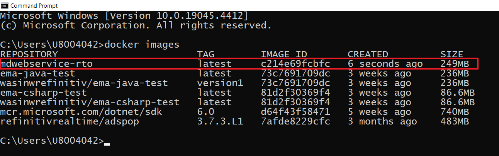
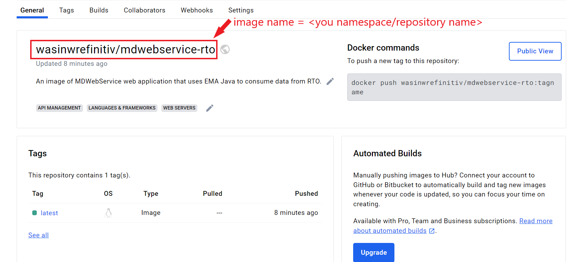

# How to Deploy EMA RTO Application to Azure

- Last Update: October 2025
- Compiler: Java, Docker, and Maven
- Prerequisite: RTO Authentication Version 2 credential

Example Code Disclaimer:
ALL EXAMPLE CODE IS PROVIDED ON AN “AS IS” AND “AS AVAILABLE” BASIS FOR ILLUSTRATIVE PURPOSES ONLY. LSEG MAKES NO REPRESENTATIONS OR WARRANTIES OF ANY KIND, EXPRESS OR IMPLIED, AS TO THE OPERATION OF THE EXAMPLE CODE, OR THE INFORMATION, CONTENT, OR MATERIALS USED IN CONNECTION WITH THE EXAMPLE CODE. YOU EXPRESSLY AGREE THAT YOUR USE OF THE EXAMPLE CODE IS AT YOUR SOLE RISK.

## Introduction

Let’s start with purpose of this project repository. This repository is forked from my colleague [How to build a scalable web service for stock prices](https://github.com/LSEG-API-Samples/Article.RTSDK.Java.MDWebService) with the following goals:

1. Update my colleague's Spring Boot MDWebService to support the Real-Time Optimized (RTO, not a **Wealth solution products**) with the Authentication Version 2 (aka Customer Identity and Access Management - CIAM, or *Service Account*).
2. Use the RTO version MDWebService as a base application for deploying to [Azure Container Instances](https://azure.microsoft.com/en-us/products/container-instances).


For more detail about the original project information, please check the following resources:

- The original project [README file](https://github.com/LSEG-API-Samples/Article.RTSDK.Java.MDWebService/blob/main/README.md).
- [How to build a scalable web service for stock prices](https://developers.lseg.com/en/article-catalog/article/scalable-web-service-for-stock) article.
- [How to deploy a web service on AWS](https://developers.lseg.com/en/article-catalog/article/how-to-deply-a-web-service-on-aws) article.

For further details about Migrating a EMA Java API application to Authentication Version 2, please check out the following resource:

- [EMA Java API: Real-Time Optimized Version 2 Authentication Migration Guide](https://developers.lseg.com/en/article-catalog/article/ema-java-api-real-time-optimized-version-2-authentication-migration-guide) article.
- [Account authorization V1 to V2 migration cheat sheet](https://developers.lseg.com/en/article-catalog/article/account-authorization-v1-to-v2-migration-cheat-sheet) article.
- [Getting Started with Version 2 Authentication for Real-Time - Optimized: Overview](https://developers.lseg.com/en/article-catalog/article/getting-started-with-version-2-authentication-for-refinitiv-real) article.

## Prerequisite

This project requires the following dependencies software and libraries.

1. Oracle 1.11 & 1.17 or OpenJDK 11.
2. [Apache Maven](https://maven.apache.org/) project management and comprehension tool.
3. Internet connection.  
4. Access to the Real-Time Optimized (**Not Wealth products**) with Authentication Version 2 (aka Customer Identity and Access Management - CIAM, or *Service Account*). The Service Account is Client ID and Client Secret.
5. [Docker Desktop](https://www.docker.com/products/docker-desktop/) or [Podman](https://podman-desktop.io/) application.
6. [Docker Hub](https://hub.docker.com/) repository account.
7. [Microsoft Azure](https://azure.microsoft.com/en-us/) account.

Please contact your LSEG representative to help you to access the RTO Service account and services.

## What I have changed from the original project

Please see more detail on the [CHANGELOG.md](./CHANGELOG.md) file.

## How to run MDWebService with RTO connection

My next point is how to set up the project for the RTO connection. Firstly, set a ```application.properties``` file to connect to RTO as follows:

```ini
#Choose connection mode RTDS or RTO
MarketData.ConnectionMode=RTO
```

Next, create a ```.env``` file in a ```MDWebService``` folder with the Authentication Version 2 credential like the following format:

```ini
#Authentication V2
CLIENT_ID=<Your Auth V2 Client-ID>
CLIENT_SECRET=<Your Auth V2 Client-Secret>
```

Finally, set the prefer RTO endpoint region in the **Location** configuration node of the ```EmaConfig.xml``` file.

```xml
<ChannelGroup>
 <ChannelList>
  <Channel>
   <Name value="Channel_RTO"/>
   <ChannelType value="ChannelType::RSSL_ENCRYPTED"/>
   <CompressionType value="CompressionType::None"/>
   <GuaranteedOutputBuffers value="5000"/>
   <!-- EMA discovers a host and a port from RDP service discovery for the specified location
				 when both of them are not set and the session management is enable. -->
   <Location value="ap-southeast"/>
   <EnableSessionManagement value="1"/>
   <ObjectName value=""/>
  </Channel>
 </ChannelList>
</ChannelGroup>
```

### Run with Java Locally

Now let me move on to how to run the project locally for testing. Once the RTO configurations above have been setup, use the following command to compile and package the file as a single executable jar file. (Note the use of Maven wrapper here):

```bash
mvnw clean package
#or
mvn clean package
```

Once the compilation is successful and a jar file has been created in the target directory, use either of the following commands to run the application locally:

```bash
mvnw spring-boot:run
#or
java -jar target\MDWebService-0.0.1-SNAPSHOT.jar
#or
mvn spring-boot:run
```


The *ChannelUp* message from EMA informs the application that it has successfully connected to the RTO server on port 14002.

Once the application is running and successfully connected to the market data system, navigating to the web URL of [http://server:port/quotes/JPY=,THB=,SGD=](http://server:port/quotes/JPY=,THB=,SGD=) should produce a JSON response like this:


Or you can run the HTTP request on the Postman.


That’s all I have to say about how to run the project locally.

### Run with Docker/Podman

So, now let’s look at how to run the project with Docker/Podman which is one of the main target of this project. Firstly, build the container image by issuing the command (a ```Dockerfile``` is available in the *MDWebService* folder):

```bash
docker build -t mdwebservice-rto .
```

This will compile the image for our container. The newly created image can be seen with the *docker images* command:

**Note**: Please note that the Real-Time SDK isn't qualified on the Docker platform. If you find any problems while running it on the Docker platform, the issues must be replicated on bare metal machines before contacting the helpdesk/Real-Time APIs support.

This will compile the image for our container. The newly created image can be seen with the ```docker images``` command:



Then created image can be run using the command:

```bash
docker run -it --rm -p 8080:8080 --env-file .env mdwebservice-rto
```

Here, we have run the container to connect to RTO. The container also binds the port 8080 used by Tomcat on to our local machine. The application can be tested by navigating to the 8080 port as done previously.


After successful test, stop the running container using the docker stop command:

```bash
docker ps -a
docker container stop <container_id>
```

That’s all I have to say about how to run the project with Docker.

## How to run MDWebService with RTDS connection

Firstly, set a ```application.properties``` file to connect to RTDS as follows:

```ini
#Choose connection mode RTDS or RTO
MarketData.ConnectionMode=RTDS
```

Next, follow the steps on the [original project](https://github.com/LSEG-API-Samples/Article.RTSDK.Java.MDWebService).

## How to deploy to Azure Cloud Service

Please see more detail on the [AZURE.md](./AZURE.md) file.




## Next Steps

That brings me to the end of this project. The step-by-step guide on this project just shows the easiest way to deploy and host your web application container on Azure cloud service as a test scenario. However, there more tasks to do if you need to deploy your production container like the following:

- Adding the SSL to your deployment for enabling the secure HTTPS connection
- Set up the load balancer and availability zone to handle more consumers traffics and for resiliency.
- Define CI/CD process for the next deployment.
- And much more.

About adding the SSL to Azure Container Instance App, there are various way to add SSL to Container Instances such as, [Enable automatic HTTPS with Caddy in a sidecar container](https://learn.microsoft.com/en-us/azure/container-instances/container-instances-container-group-automatic-ssl), [Enable a TLS endpoint in a sidecar container](https://learn.microsoft.com/en-us/azure/container-instances/container-instances-container-group-ssl).

There are also other Azure Container services like [Azure App Service](https://azure.microsoft.com/en-in/products/app-service) or [Azure Container Apps](https://azure.microsoft.com/en-us/products/container-apps) that supports automatic scalability, more advanced network control/configurations, easy to connect to other Azure services, and built-in SSL supported. They are the service that I will be explored with our LSEG APIs in the future.

To learn more about the Azure App Services and Container Apps, please check the following resources:

- [Quickstart: Run a custom container in Azure App Services](https://learn.microsoft.com/en-us/azure/app-service/quickstart-custom-container?pivots=container-linux-azure-portal&tabs=dotnet)
- [Azure Container Apps Overview](https://learn.microsoft.com/en-us/azure/container-apps/overview)
- [Quickstart: Deploy your first container app using the Azure portal](https://learn.microsoft.com/en-us/azure/container-apps/quickstart-portal)
- [Azure App Service vs Azure Container Apps - which to use?](https://learn.microsoft.com/en-us/answers/questions/1337789/azure-app-service-vs-azure-container-apps-which-to)

Meanwhile, the open-source nature of the RTSDK makes the SDK easy to deploy on the Cloud Service. With the EMA API, you can create a Real-Time application with ease-of-use interfaces and easy to integrate with other services.

For more detail about the Real-Time SDKs, please check the following resources:

- [RTSDK C/C++ edition](https://developers.lseg.com/en/api-catalog/refinitiv-real-time-opnsrc/rt-sdk-cc)
- [RTSDK C# edition](https://developers.lseg.com/en/api-catalog/refinitiv-real-time-opnsrc/refinitiv-real-time-csharp-sdk)
- [RTSDK Java edition](https://developers.lseg.com/en/api-catalog/refinitiv-real-time-opnsrc/rt-sdk-java)

## Special Thank

Kudos to [Gurpreet Bal](https://github.com/ardyesp) for the original version of the [MDWebService source code](https://github.com/LSEG-API-Samples/Article.RTSDK.Java.MDWebService) and articles.

## Reference

For further details, please check out the following resources:

- [Real-Time SDK Java page](https://developers.lseg.com/en/api-catalog/real-time-opnsrc/rt-sdk-java) on the [LSEG Developer Community](https://developers.lseg.com/) website.
- [The Real-Time SDK Family](https://developers.lseg.com/en/use-cases-catalog/real-time) page.
- [Enterprise Message API Java Quick Start](https://developers.lseg.com/en/api-catalog/real-time-opnsrc/rt-sdk-java/quick-start)
- [Developer Webinar: Introduction to Enterprise App Creation With Open-Source Enterprise Message API](https://www.youtube.com/watch?v=2pyhYmgHxlU)
- [Developer Article: 10 important things you need to know before you write an Enterprise Real Time application](https://developers.lseg.com/article/10-important-things-you-need-know-you-write-elektron-real-time-application)
- [Comparing Container Apps with other Azure container options](https://learn.microsoft.com/en-us/azure/container-apps/compare-options) article.
- [Changes to Customer Access and Identity Management: Real-Time - Optimized](https://developers.lseg.com/en/article-catalog/article/changes-to-customer-access-and-identity-management--refinitiv-re)
- [How to build a scalable web service for stock prices](https://developers.lseg.com/en/article-catalog/article/scalable-web-service-for-stock) article.
- [How to deploy a web service on AWS](https://developers.lseg.com/en/article-catalog/article/how-to-deply-a-web-service-on-aws) article.
- [Azure Portal](https://azure.microsoft.com/en-us/)
- [Microsoft Learn for Azure](https://learn.microsoft.com/en-us/training/azure/) website.
- [Difference between Azure Container Instances and Azure Container Apps - serverfault](https://serverfault.com/questions/1083358/difference-between-azure-container-instances-and-azure-container-apps) post.
- [Azure Container Instances Service](https://azure.microsoft.com/en-us/products/container-instances)
- [Azure Container Instances documentation](https://learn.microsoft.com/en-us/azure/container-instances/)
- [How to enable TLS for Hasura GraphQL Engine in an Azure Container Instance with Caddy](https://www.antstack.com/blog/how-to-enable-tls-for-hasura-graphql-engine-in-azure-caddy/) blog post.
- [Adding SSL/TLS To Azure Container Instances](https://samkreter.medium.com/adding-ssl-tls-to-azure-container-instances-1e608a8f321c) blog post.
- [Enable automatic HTTPS with Caddy in a sidecar container](https://learn.microsoft.com/en-us/azure/container-instances/container-instances-container-group-automatic-ssl) document.
- [Enable a TLS endpoint in a sidecar container](https://learn.microsoft.com/en-us/azure/container-instances/container-instances-container-group-ssl) document.

For any question related to this article or the RTSDK page, please use the Developer Community [Q&A Forum](https://community.developers.refinitiv.com/).
