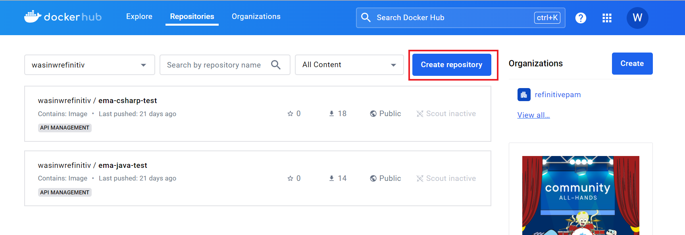
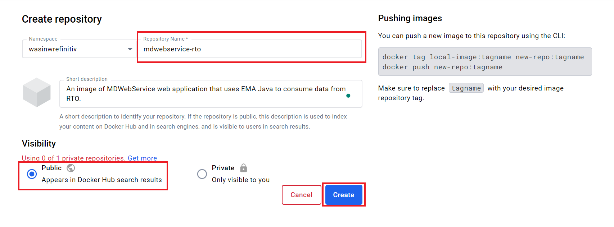
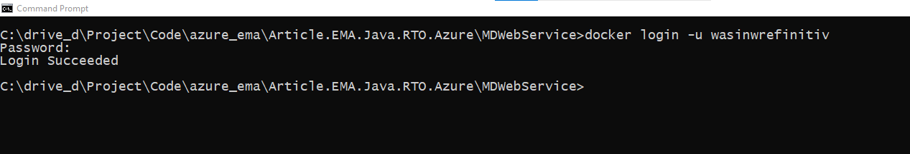
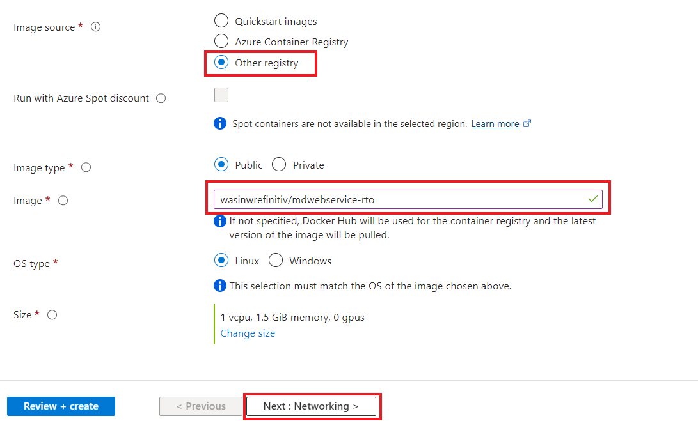
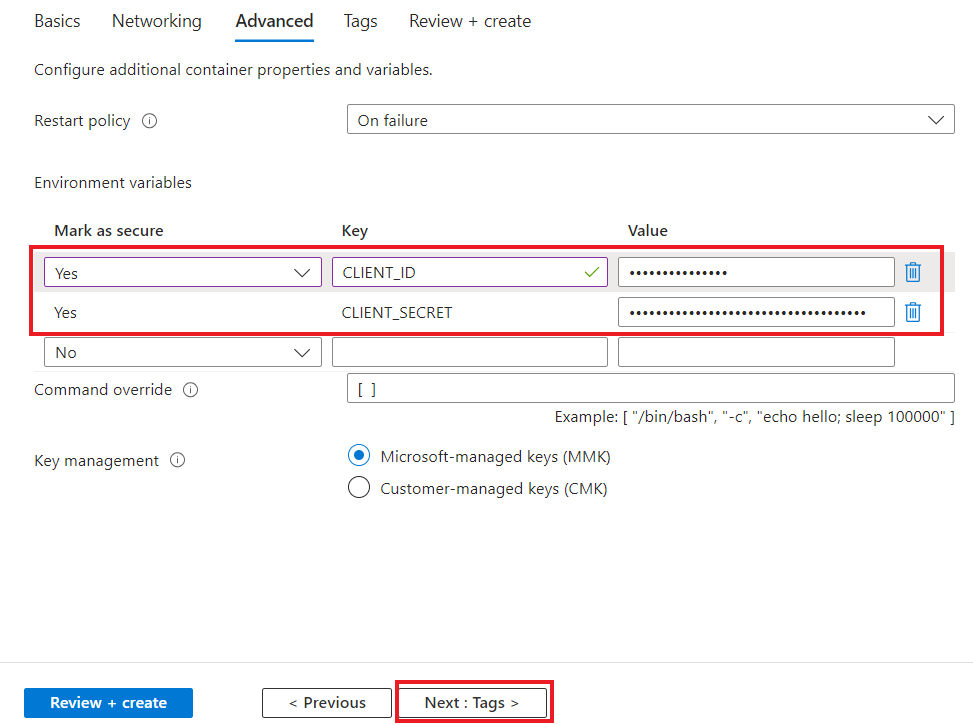
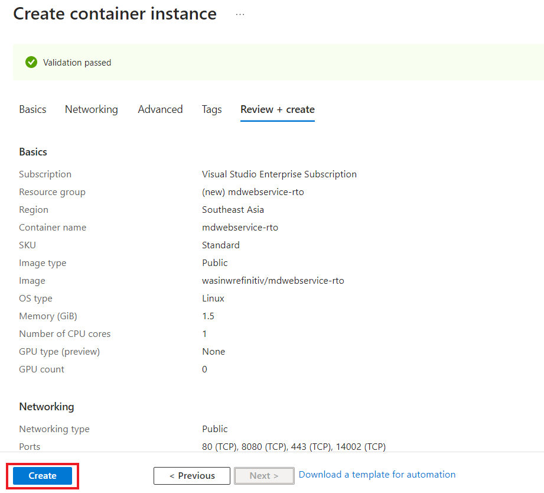
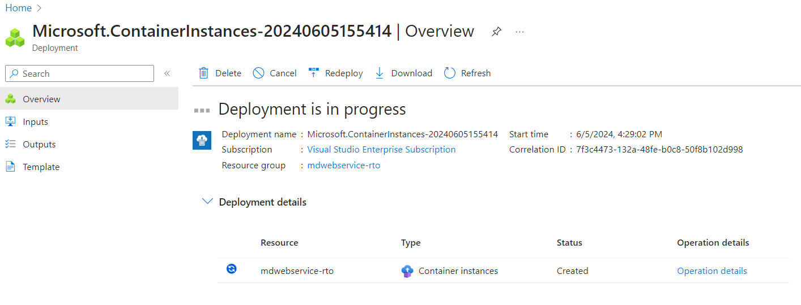
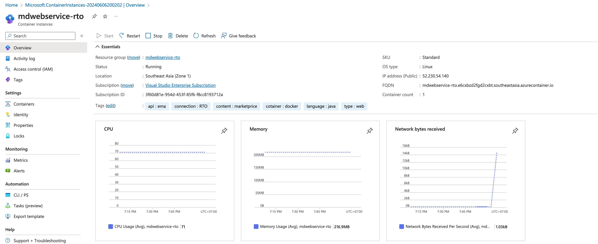

# How to Deploy EMA RTO Application to Azure

- Last Update: May 2024
- Compiler: Java, Docker, and Maven
- Prerequisite: RTO Authentication Version 2 credential

Example Code Disclaimer:
ALL EXAMPLE CODE IS PROVIDED ON AN “AS IS” AND “AS AVAILABLE” BASIS FOR ILLUSTRATIVE PURPOSES ONLY. REFINITIV MAKES NO REPRESENTATIONS OR WARRANTIES OF ANY KIND, EXPRESS OR IMPLIED, AS TO THE OPERATION OF THE EXAMPLE CODE, OR THE INFORMATION, CONTENT, OR MATERIALS USED IN CONNECTION WITH THE EXAMPLE CODE. YOU EXPRESSLY AGREE THAT YOUR USE OF THE EXAMPLE CODE IS AT YOUR SOLE RISK.

## Introduction

This repository is forked from my colleague [How to build a scalable web service for stock prices](https://github.com/LSEG-API-Samples/Article.RTSDK.Java.MDWebService) with the following goals:

1. Update my colleague's Spring Boot MDWebService to support the Real-Time Optimized (RTO, not a **Wealth solution products**) with the Authentication Version 2 (aka Customer Identity and Access Management - CIAM, or *Service Account*).
2. Use the RTO version MDWebService as a base application for deploying to [Azure Container Instances](https://azure.microsoft.com/en-us/products/container-instances).

For more detail about the original project information, please check the following resources:

- The original project [README file](https://github.com/LSEG-API-Samples/Article.RTSDK.Java.MDWebService/blob/main/README.md).
- [How to build a scalable web service for stock prices](https://developers.lseg.com/en/article-catalog/article/scalable-web-service-for-stock) article.
- [How to deploy a web service on AWS](https://developers.lseg.com/en/article-catalog/article/how-to-deply-a-web-service-on-aws) article.

For further details about Migrating a EMA Java API application to Authentication Version 2, please check out the following resource:

- [EMA Java API: Refinitiv Real-Time Optimized Version 2 Authentication Migration Guide](https://developers.lseg.com/en/article-catalog/article/ema-java-api-real-time-optimized-version-2-authentication-migration-guide) article.
- [Account authorization V1 to V2 migration cheat sheet](https://developers.lseg.com/en/article-catalog/article/account-authorization-v1-to-v2-migration-cheat-sheet) article.
- [Getting Started with Version 2 Authentication for Real-Time - Optimized: Overview](https://developers.lseg.com/en/article-catalog/article/getting-started-with-version-2-authentication-for-refinitiv-real) article.

## Prerequisite

This project requires the following dependencies software and libraries.

1. Oracle 1.11 & 1.17 or OpenJDK 11.
2. [Apache Maven](https://maven.apache.org/) project management and comprehension tool.
3. Internet connection.  
4. Access to the Real-Time Optimized (**Not Wealth products**) with Authentication Version 2 (aka Customer Identity and Access Management - CIAM, or *Service Account*). The Service Account is Client ID and Client Secret.
5. [Docker Desktop](https://www.docker.com/products/docker-desktop/) application.
6. [Docker Hub](https://hub.docker.com/) repository account.
7. [Microsoft Azure](https://azure.microsoft.com/en-us/) account.

Please contact your LSEG representative to help you to access the RTO Service account and services.

## What I have changed from the original project

Please see more detail on the [CHANGELOG.md](./CHANGELOG.md) file.

## How to run MDWebService with RTO connection

Firstly, set a ```application.properties``` file to connect to RTO as follows:

```ini
#Choose connection mode RTDS or RTO
MarketData.ConnectionMode=RTO
```

Next, create a ```.env``` file in a ```MDWebService``` folder with the Authentication Version 2 credential like the following format:

```ini
#Authentication V2
CLIENT_ID=<Your Auth V2 Client-ID>
CLIENT_SECRET=<Your Auth V2 Client-Secret>
```

Finally, set the prefer RTO endpoint region in the **Location** configuration node of the ```EmaConfig.xml``` file.

```xml
<ChannelGroup>
 <ChannelList>
  <Channel>
   <Name value="Channel_RTO"/>
   <ChannelType value="ChannelType::RSSL_ENCRYPTED"/>
   <CompressionType value="CompressionType::None"/>
   <GuaranteedOutputBuffers value="5000"/>
   <!-- EMA discovers a host and a port from RDP service discovery for the specified location
				 when both of them are not set and the session management is enable. -->
   <Location value="ap-southeast"/>
   <EnableSessionManagement value="1"/>
   <ObjectName value=""/>
  </Channel>
 </ChannelList>
</ChannelGroup>
```

### Run with Java Locally

Once the development environment has Maven setup, use the following command to compile and package the file as a single executable jar file. (Note the use of Maven wrapper here):

```bash
mvnw clean package
```

Once the compilation is successful and a jar file has been created in the target directory, use either of the following commands to run the application locally:

```bash
mvnw spring-boot:run
#or
java -jar target\MDWebService-0.0.1-SNAPSHOT.jar
```


The *ChannelUp* message from EMA informs the application that it has successfully connected to the RTO server on port 14002.

Once the application is running and successfully connected to the market data system, navigating to the web URL of [http://server:port/quotes/JPY=,THB=,SGD=](http://server:port/quotes/JPY=,THB=,SGD=) should produce a JSON response like this:


Or you can run the HTTP request on the Postman.


### Run with Docker

Firstly, build the container image by issuing the command (Dockerfile should be available in this *MDWebService*):

```bash
docker build -t mdwebservice-rto .
```

This will compile the image for our container. The newly created image can be seen with the *docker images* command:

**Note**: Please note that the Real-Time SDK isn't qualified on the Docker platform. If you find any problems while running it on the Docker platform, the issues must be replicated on bare metal machines before contacting the helpdesk/Real-Time APIs support.

This will compile the image for our container. The newly created image can be seen with the ```docker images``` command:


Then created image can be run using the command:

```bash
docker run -it --rm -p 8080:8080 --env-file .env mdwebservice-rto
```

Here, we have run the container to connect to RTO. The container also binds the port 8080 used by Tomcat on to our local machine. The application can be tested by navigating to the 8080 port as done previously.


After successful test, stop the running container using the docker stop command:

```bash
docker ps -a
docker container stop <container_id>
```

## How to run MDWebService with RTDS connection

Firstly, set a ```application.properties``` file to connect to RTDS as follows:

```ini
#Choose connection mode RTDS or RTO
MarketData.ConnectionMode=RTDS
```

Next, follow the steps on the [original project](https://github.com/LSEG-API-Samples/Article.RTSDK.Java.MDWebService).

## How to deploy to Azure Cloud Service

Normally, there are various ways to deployed an application on the cloud service like create a Virtual Machine (VM) on the cloud, or use the Serverless or Platform as a Service (PaaS) to run application's source code on the cloud, or use the fully managed container orchestration service to run an application's container. It is based on your preference of manageability, business logic and cost to choose which way is suitable for you.

The VM way is supported by all major Cloud services like the [Azure Virtual Machine](https://azure.microsoft.com/en-us/products/virtual-machines), [AWS EC2](https://aws.amazon.com/ec2/), and [Google Cloud Compute Engine](https://cloud.google.com/products/compute/). However, it requires a lot of manual work such as manage and set up the machine, install all application's dependencies, and run an application by yourself manually. This is the reason our article does not choose the VM way.

Since our MDWebService application already have been containerize, this article chooses the fully managed container orchestration service way.

Azure provides various services for supporting different requirements,cost, and your application's preference. You can find more detail about the comparisons of all services that supports containerized applications on Azure on [Comparing Container Apps with other Azure container options](https://learn.microsoft.com/en-us/azure/container-apps/compare-options) and [Difference between Azure Container Instances and Azure Container Apps - serverfault](https://serverfault.com/questions/1083358/difference-between-azure-container-instances-and-azure-container-apps) websites. I am choosing the [Azure Container Instances service](https://azure.microsoft.com/en-us/products/container-instances) which is the easiest one.

### Container Registry

Azure also has the [Container Registry Service](https://azure.microsoft.com/en-us/products/container-registry) repository for storing and managing container images and artifacts with a fully managed environment within Azure. This repository requires the [Azure CLI](https://learn.microsoft.com/en-us/cli/azure/) tool to push/pull an application image to Azure container registry.

However, the service also supports [Docker Hub registry](https://hub.docker.com/) repository, so I am choosing this way because I can set other Cloud Container solutions to pull image from Docker Hub as well.

### Push Image to Docker Hub

The steps to push an MDWebService application image to Docker Hub repository are as follows.

Firstly, log in to [Docker Hub registry](https://hub.docker.com/) website, and select the **Create repository** button.



Next, input **Repository Name** as *mdwebservice-rto*, input a short description of your image, and choose **Public Visibility**. And then click the **Create** button.



Once the repository is created successfully, the page redirects you to your repository page which contains commands to [push](https://docs.docker.com/reference/cli/docker/image/push/) your local image to this repository.


Moving on to the next step to push image, open a command prompt and run the following command to log in to Docker Hub via the CLI.

```bash
docker login -u YOUR-USER-NAME
```


Then input your Docker Hub account credential (*password* or *token*), then press the Enter button



Once you have logged in to Docker Hub on the CLI, use the [docker tag]((https://docs.docker.com/reference/cli/docker/image/tag/)) command to give the *mdwebservice-rto* image a new name.

```bash
docker tag mdwebservice-rto wasinwrefinitiv/mdwebservice-rto
```


Once the image has been tagged, run the docker push command. Please note that if you don't specify a tagname part, Docker uses a tag called latest.

```bash
docker push wasinwrefinitiv/mdwebservice-rto
```


Then go back to Docker Hub website, the repository page shows your image detail. You can add the repository's category and overview based on your preference.

Please note that your image name is **&lt;your namespace&gt;/&lt;repository name&gt;** (*wasinwrefinitiv/mdwebservice-rto* in my case).


You can find more detail about how to push an application image to Docker Hub on [Share the application](https://docs.docker.com/get-started/04_sharing_app/) document.

### Creating Azure Container Instances

Firstly, open a web browser to [Azure portal](https://azure.microsoft.com) website, then type *Container Instances* in a search bar. The Container Instance Service menu will be appeared, choose that menu.


The page redirects to the Container Instances resource management page. To create a container, you can click either the *+Create* button or *Create container instances* button.


You are now in the Container instances creation page. The first step is choosing your Azure subscription and create a new Resource group. I choose the *mdwebserivce-rto* name for the new Resource Group.


Next, input a container name. I choose *mdwebservice-rto* as my container name. Select your prefer region and numbers of [Availability zone](https://learn.microsoft.com/en-us/azure/reliability/reliability-containers).


Now we need to input the image detail as follows, and then click the *Next: Networking* button.

- Image source: For [Docker Hub registry](https://hub.docker.com/), choose *Other registry*
- Image type: Public
- Image: Input your image name (**&lt;your namespace&gt;/&lt;repository name&gt;**)
- Leave other options as is.



That brings us to the network creation page. Set the DNS named label to *mdwebservice-rto* and add the following ports with type **TCP** to our instance:

- 8080 (for our Web Server)
- 443 (for connecting to RDP API)
- 14002 (for the RSSL connection)


And click the *Next: Advanced* button.

Moving on to advanced page. We can set a container's Environment Variables here. Please choose *Mark as secure* as *Yes* and input the following keys and values

- CLIENT_ID: Your Authentication V2 Client ID
- ClIENT_SECRET: Your Authentication V2 Client Secret

And click the *Next: Tags* button.



Next, choose your prefer tag names and values, then click the *Next: Review + create* button.

Now we come to the final step. You can review your setting here and go back for changing any properties you need. If set up looks fine, click the *Create* button.



Then the Azure Container Instances service deploys your image.



Once deployment is completed. You can click the *Go to resource* button to check your newly deployed container.


That brings us to the mdwebservice-rto instance resource page. The overview page contains the statistic of resource usages, container status, and the Public IP Address and container's automatically assigned DNS name. Please note that you can start, stop, and delete the instance from this resource page too.



You can click on the Settings --> container tab --> Log to check the application's console log messages.


To test the deployed web server instant, copy the DNS url from the *FQDN* property (in the red circle), and open it on your web browser as *http://&lt;FQDN name&gt;:port/quotes/RIC_Code* URL.


Please note that with the autogenerated domain name, *the URL might be blocked by corporate firewall or network policy*. I am testing and capturing the image from my personal machine.


That’s all I have to say about how to deploy a web service container to Azure.

## Clean Up

My next point is how to clean up the resources if you do not need to run an instance anymore (for cost saving too!).

On the Container Instance Resources page, you can restart, stop, or delete an instance from the menu on this page.


That covers overall steps of deploying EMA instance on the Azure Container Instance service.

## Next Steps

The step-by-step guide above just shows the easiest way to deploy and host your web application container on Azure cloud service as a test scenario. However, there more tasks to do if you need to deploy your production container like the following:

- Adding the SSL to your deployment for enabling the secure HTTPS connection
- Set up the load balancer and availability zone to handle more consumers traffics and for resiliency.
- Define CI/CD process for the next deployment.
- And much more.

About adding the SSL to Azure Container Instance App, there are various way to add SSL to Container Instances such as, [Enable automatic HTTPS with Caddy in a sidecar container](https://learn.microsoft.com/en-us/azure/container-instances/container-instances-container-group-automatic-ssl), [Enable a TLS endpoint in a sidecar container](https://learn.microsoft.com/en-us/azure/container-instances/container-instances-container-group-ssl).

There are also other Azure Container services like [Azure App Service](https://azure.microsoft.com/en-in/products/app-service) or [Azure Container Apps](https://azure.microsoft.com/en-us/products/container-apps) that supports automatic scalability, more advanced network control/configurations, easy to connect to other Azure services, and built-in SSL supported. They are the service that I will be explored with our LSEG APIs in the future.

To learn more about the Azure App Services and Container Apps, please check the following resources:

- [Quickstart: Run a custom container in Azure App Services](https://learn.microsoft.com/en-us/azure/app-service/quickstart-custom-container?pivots=container-linux-azure-portal&tabs=dotnet)
- [Azure Container Apps Overview](https://learn.microsoft.com/en-us/azure/container-apps/overview)
- [Quickstart: Deploy your first container app using the Azure portal](https://learn.microsoft.com/en-us/azure/container-apps/quickstart-portal)
- [Azure App Service vs Azure Container Apps - which to use?](https://learn.microsoft.com/en-us/answers/questions/1337789/azure-app-service-vs-azure-container-apps-which-to)

Meanwhile, the open-source nature of the RTSDK makes the SDK easy to deploy on the Cloud Service. With the EMA API, you can create a Real-Time application with ease-of-use interfaces and easy to integrate with other services.

For more detail about the Real-Time SDKs, please check the following resources:

- [RTSDK C/C++ edition](https://developers.lseg.com/en/api-catalog/refinitiv-real-time-opnsrc/rt-sdk-cc)
- [RTSDK C# edition](https://developers.lseg.com/en/api-catalog/refinitiv-real-time-opnsrc/refinitiv-real-time-csharp-sdk)
- [RTSDK Java edition](https://developers.lseg.com/en/api-catalog/refinitiv-real-time-opnsrc/rt-sdk-java)

## Special Thank

Kudos to [Gurpreet Bal](https://github.com/ardyesp) for the original version of the [MDWebService source code](https://github.com/LSEG-API-Samples/Article.RTSDK.Java.MDWebService) and articles.

## Reference

For further details, please check out the following resources:

- [Real-Time SDK Java page](https://developers.lseg.com/en/api-catalog/refinitiv-real-time-opnsrc/rt-sdk-java) on the [LSEG Developer Community](https://developers.lseg.com/) website.
- [The Real-Time SDK Family](https://developers.lseg.com/en/use-cases-catalog/refinitiv-real-time) page.
- [Enterprise Message API Java Quick Start](https://developers.lseg.com/en/api-catalog/refinitiv-real-time-opnsrc/rt-sdk-java/quick-start)
- [Developer Webinar: Introduction to Enterprise App Creation With Open-Source Enterprise Message API](https://www.youtube.com/watch?v=2pyhYmgHxlU)
- [Developer Article: 10 important things you need to know before you write an Enterprise Real Time application](https://developers.lseg.com/article/10-important-things-you-need-know-you-write-elektron-real-time-application)
- [Comparing Container Apps with other Azure container options](https://learn.microsoft.com/en-us/azure/container-apps/compare-options) article.
* [Changes to Customer Access and Identity Management: Refinitiv Real-Time - Optimized](https://developers.refinitiv.com/en/article-catalog/article/changes-to-customer-access-and-identity-management--refinitiv-re)
- [How to build a scalable web service for stock prices](https://developers.lseg.com/en/article-catalog/article/scalable-web-service-for-stock) article.
- [How to deploy a web service on AWS](https://developers.lseg.com/en/article-catalog/article/how-to-deply-a-web-service-on-aws) article.
- [Azure Portal](https://azure.microsoft.com/en-us/)
- [Microsoft Learn for Azure](https://learn.microsoft.com/en-us/training/azure/) website.
- [Difference between Azure Container Instances and Azure Container Apps - serverfault](https://serverfault.com/questions/1083358/difference-between-azure-container-instances-and-azure-container-apps) post.
- [Azure Container Instances Service](https://azure.microsoft.com/en-us/products/container-instances)
- [Azure Container Instances documentation](https://learn.microsoft.com/en-us/azure/container-instances/)
- [How to enable TLS for Hasura GraphQL Engine in an Azure Container Instance with Caddy](https://www.antstack.com/blog/how-to-enable-tls-for-hasura-graphql-engine-in-azure-caddy/) blog post.
- [Adding SSL/TLS To Azure Container Instances](https://samkreter.medium.com/adding-ssl-tls-to-azure-container-instances-1e608a8f321c) blog post.
- [Enable automatic HTTPS with Caddy in a sidecar container](https://learn.microsoft.com/en-us/azure/container-instances/container-instances-container-group-automatic-ssl) document.
- [Enable a TLS endpoint in a sidecar container](https://learn.microsoft.com/en-us/azure/container-instances/container-instances-container-group-ssl) document.

For any question related to this article or the RTSDK page, please use the Developer Community [Q&A Forum](https://community.developers.refinitiv.com/).
